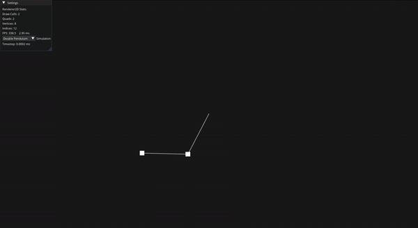
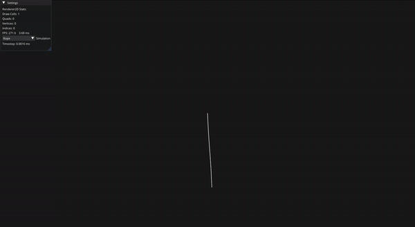

# Physim

**Physim** is a visualizer for [Physics](https://github.com/EmomaxD/Physics). It allows users to explore various physics simulations in an interactive environment.

## Features

- **Double Pendulum**: Simulate the motion of a double pendulum with realistic physics.
- **Rope Simulation**: Visualize the behavior of ropes under various forces.
- **Cloth Simulation**: Experience how cloth behaves in a simulated environment.

